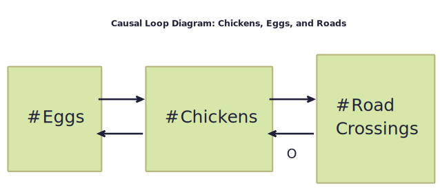

# Systems Thinking Kata: Project vs Product

A systems thinking / modeling kata based on a talk given by Edwin Burgers at [SoCraTes 2024](https://socratesbe.org).
This repository contains a general overview of the approach, a description of the excercise, and a bunch of diagrams for you to toy with.

## Methodology

Using the "Causal Loops" diagramming technique, participants will determine how different organizational elements impact 
the business goal of Customer Satisfaction Rate (i.e. delivering as much value to their customers as possible).

> **First Law of Diagramming:**
> The primary value in diagrams is in the discussion while diagramming—we model to have a conversation.

## The Kata

> **Remember the Guiding Principle of Models:**  
> All models are wrong, some happen to be useful.

### Background

### Approach

### Session Overview

## References

* Edwin Burgers workshop at [SoCraTes 2024](https://socratesbe.org/)
* [LESS: Architecture & Design](https://less.works/less/technical-excellence/architecture-design)
* [SPARK: Addressing Complexity Toolkit](https://spark.mcmaster.ca/)
* Kim, H.D. (?) [Guidelines for Drawing Causal Loop Diagram](https://www.cs.toronto.edu/~sme/SystemsThinking/GuidelinesforDrawingCausalLoopDiagrams.pdf). University of Toronto.
* Sterman, J.D. (2000) [Business Dynamics: Systems Thinking and Modeling for a Complex World](https://www.goodreads.com/book/show/39736248-business-dynamics). McGraw-Hill Education. isbn: 978-0072389159
