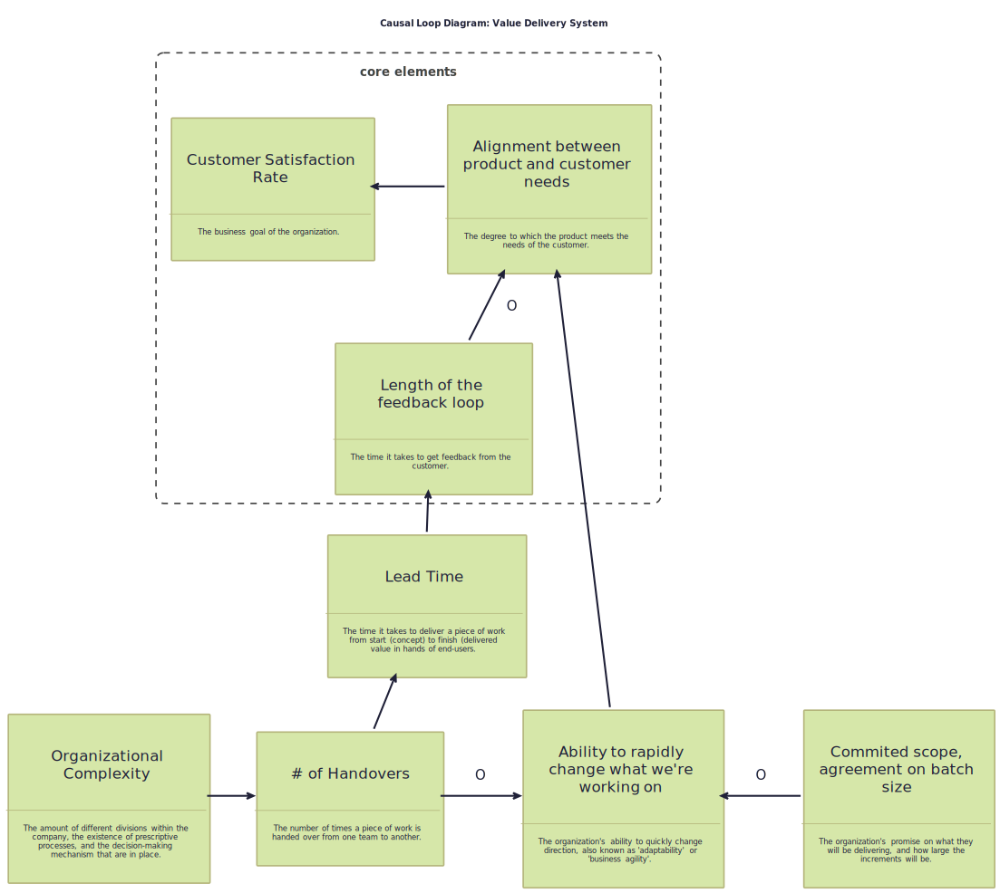

# Systems Thinking Kata: Project vs Product

A systems thinking / modeling kata based on a talk given by [Edwin Burgers](https://www.linkedin.com/in/edwinburgers/) at the
[SoCraTes 2024](https://socratesbe.org) unconference. This repository contains a general overview of the approach, a description of the excercise,
and a bunch of diagrams for you to toy with.

---
**Contents:**

<!-- TOC -->

* [Goal](#goal)
* [Methodology](#methodology)
* [The Kata](#the-kata)
    * [Background](#background)
    * [Approach](#approach)
    * [Session Overview](#session-overview)
        * [**Step 1:** Identify the Base Elements](#step-1-identify-the-base-elements)
        * [**Step 2:** Add Organizational Elements](#step-2-add-organizational-elements)
        * [**Step 3:** Add Timeliness Elements](#step-3-add-timeliness-elements)
        * [**Step 4:** Add Risk Mitigation Elements](#step-4-add-risk-mitigation-elements)
        * [**Round-Up:** Conclusions and Learnings](#round-up-conclusions-and-learnings-)
* [References](#references)

<!-- TOC -->

---

## Goal

The goal of this architecture kata is to help participants understand the complexity of the relationship between different organizational elements
and how they impact the business goal of Customer Satisfaction Rate. As a secondary learning objective, participants will learn the basics of using
the `Causal Loops` diagramming technique to model complicated / complex systems.

## Methodology

Using the "Causal Loops" diagramming technique, participants will determine how different organizational elements impact
the business goal of Customer Satisfaction Rate (i.e. delivering as much value to their customers as possible).

> **First Law of Diagramming:**
> The primary value in diagrams is in the discussion while diagramming—we model to have a conversation.

## The Kata

We will use the causal loop diagramming technique to investigate the impact of working in a "project" vs "product" mode on the business goal of
delivering as much value to our customers as possible. To achieve this, we will follow the reasoning of existing literature, and use them to 
construct a model that represents the relationships between the different elements.

Participants will work in groups to discuss the relationships between the different elements, and will use the diagram to facilitate the
discussion. Our main learning objectives are two-fold: 

* We want to understand the complexity of choosing an approach
* We want to learn how to use the causal loop diagramming technique to model complex systems.

### Background

### Approach

The session will be structured as a series of increments, working from a simple (provided) base system to a more complex model that includes a
plethora of elements. Ideally, the session can be conducted in a workshop setting, where participants can work in groups (up to 4 people) to
collaboratively build the diagram. The session will be facilitated by a person who is familiar with the technique, and who can guide the
participants through the process, providing context and explanations where necessary, and can be called upon to answer questions or make a judgement
call to "unblock" a group/participant and keep the session moving forward.

The session will progress in a series of steps, where we will add new elements to the diagram, and discuss how they interrelate with the existing
elements. After each step, people will have the opportunity to discuss their findings, reasoning, and any insights they have gained. 
Afterwards, an "example solution" will be presented, based on the contents of various literature sources. 
This will be used to compare and contrast the different approaches, and to highlight the intricacies of creating a model of a complex adaptive system.

In order for the sessions to be successful, participants are offered the opportunity to reset their diagram at any time, and to continue their 
work on top of the existing example solution. This will allow them to explore different paths, while still having a reference point to fall back 
to in case they get stuck or diverge too far from the provided example.

> **Remember the Guiding Principle of Models:**  
> All models are wrong, some happen to be useful.

The existence of an "example solution" is not meant to be prescriptive, but rather to provide a reference point for participants to compare 
their own reasoning and findings against. As mentioned in the first law of diagramming, the primary value in diagrams is in the discussions we 
have while creating them. The example solution is meant to facilitate these discussions, and to provide a starting point for further exploration.
**They are not meant to be the final word on the subject, but rather a stepping stone to further understanding.**

### Session Content

#### **Step 1:** Identify the Base Elements

> **core premise:**  
> _"We should have customer focus -- deliver as much value to our customers as possible."_

The base elements are the core elements that are essential to the business goal of the organization. In this case, the core premise is that the
organization should have a customer focus and deliver as much value to their customers as possible. As such, we will identify the following key
elements that make up the base system:

* **Customer Satisfaction Rate:** The business goal of the organization.
* **Alignment between product and customer needs:** The degree to which the product meets the needs of the customer.
* **Length of the feedback loop:** The time it takes to get feedback from the customer.

The diagram below shows the relationship between these elements.

You can find the editable version of this diagram in the `src` folder: [`src/kata/base-system.puml`](./src/kata/base-system.puml).

#### **Step 2:** Add Organizational Elements

> **core premise:**  
> _"That's a lot of work, big impact... We need to organise that!"_

In this step, we will identify the organizational elements that impact the base system.
These elements are the organizational structures, processes, and practices that influence the delivery causal system.
Our goal is to indentify how these elements impact the existing system elements, i.e. whether they have a counteracting (Opposite) or
reinforcing (same) effect.

The organizational elements we will consider are:

* **Ability to rapidly change what we're working on:** The organization's ability to quickly change direction, also known as 'adaptability' or
  'business agility'.
* **Commited scope, agreement on batch size:** The organization's promise on what they will be delivering, and how large the increments will be.
* **Organisational Complexity:** The amount of different divisions within the company, the existence of prescriptive processes, and the
  decision-making mechanism that are in place.
* **# of Handovers:** The number of times a piece of work is handed over from one team to another.
* **Lead Time:** The time it takes to deliver a piece of work from start (concept) to finish (delivered value in hands of end-users).

##### Exercise

Add the organizational elements to the diagram and identify the relationships between the elements.
Focus on the primary relationships between the elements, and aim to map out the key interactions between the existing and new elements.
There are no right or wrong answers, but the goal is to have a conversation about how the organizational elements impact the base system.

The elements, and their definitions, are:

* **Ability to rapidly change what we're working on**: "The organization's ability to quickly change direction, also known as 'adaptability' or
  'business agility'."
* **Commited scope, agreement on batch size**: "The organization's promise on what they will be delivering, and how large the increments will be."
* **Organizational Complexity**: "The amount of different divisions within the company, the existence of prescriptive processes, and the
  decision-making mechanism that are in place."
* **# of Handovers**: "The number of times a piece of work is handed over from one team to another."
* **Lead Time**: "The time it takes to deliver a piece of work from start (concept) to finish (delivered value in hands of end-users.")

##### Possible Solution

#### **Step 3:** Add Timeliness Elements

#### **Step 4:** Add Risk Mitigation Elements

#### **Round-Up:** Conclusions and Learnings

## References

* Edwin Burgers workshop at [SoCraTes 2024](https://socratesbe.org/)
* [LESS: Architecture & Design](https://less.works/less/technical-excellence/architecture-design)
* [SPARK: Addressing Complexity Toolkit](https://spark.mcmaster.ca/)
* Kim,
  H.D. (?) [Guidelines for Drawing Causal Loop Diagram](https://www.cs.toronto.edu/~sme/SystemsThinking/GuidelinesforDrawingCausalLoopDiagrams.pdf).
  University of Toronto.
* Sterman, J.D. (
  2000) [Business Dynamics: Systems Thinking and Modeling for a Complex World](https://www.goodreads.com/book/show/39736248-business-dynamics).
  McGraw-Hill Education. isbn: 978-0072389159
